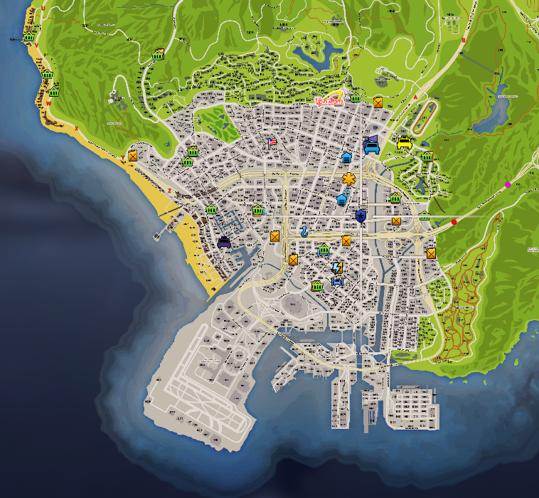
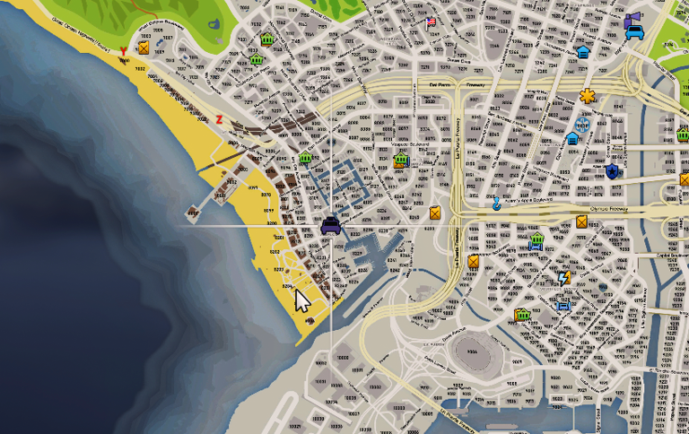

# 👏 Débuter l'aventure

Bienvenue dans la ville de Thunder RP.&#x20;

Afin de bien débuter votre aventure, voici une liste d'étapes essentielles à votre intégration dans notre belle ville !&#x20;

## Achetez votre premier téléphone !

Vous pouvez acheter votre premier téléphone directement à l'aéroport, dans le magasin DigitalDen.

<figure class="basic-img"><figcaption>DigitalDen à l'aéroport</figcaption></figure>

## Vous faire recenser !

Vous devez vous faire recenser au post de police de mission row!&#x20;

<figure class="basic-img"><figcaption>Mission Row Police Department</figcaption></figure>

## Votre permis de conduire !

Vous pouvez passer votre permis.

  

    <button class="tab-button active" data-tab="photo">Photo</button>
    <button class="tab-button" data-tab="position">Position</button>
  

  
  

    <figure><figcaption>Photo du bâtiment de l'auto-école</figcaption></figure>
  

  
  

    <figure><figcaption>Position de l'auto-école sur la carte</figcaption></figure>
  

## Gagnez de l'argent&#x20;

Pour gagner de l'argent, vous pouvez faire un job en intérim (Automatique) ou alors vous faire recruter dans une entreprise !