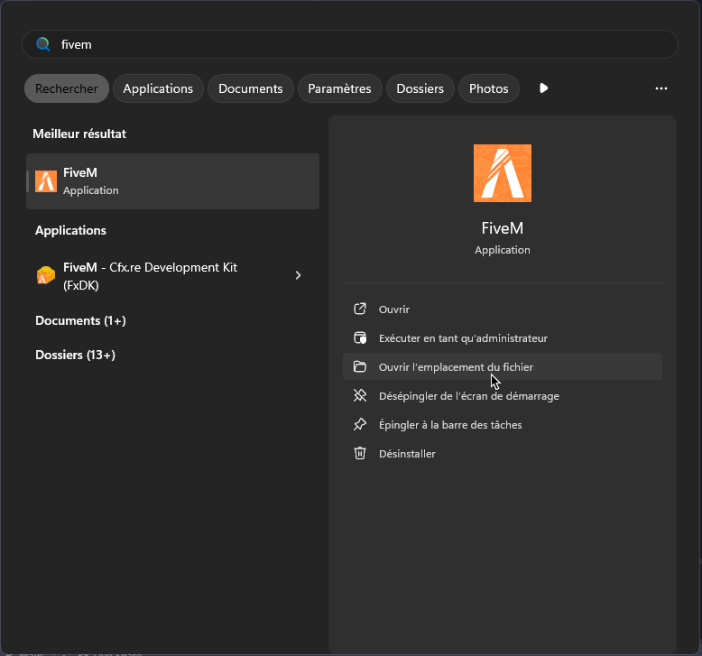
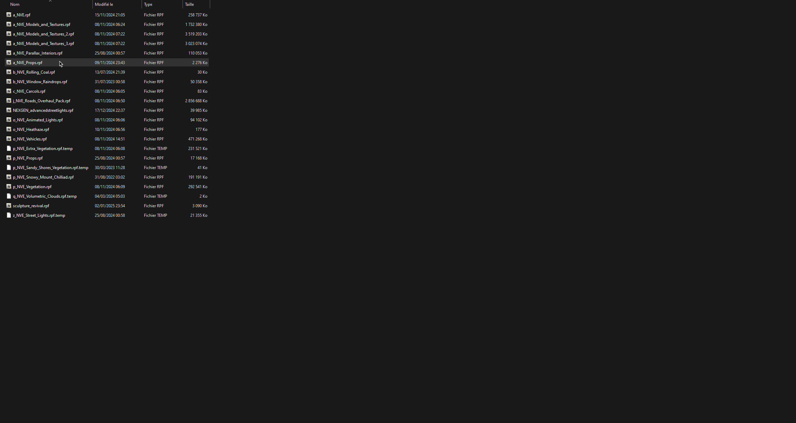

# 🚨Problème
Il se peut que votre jeu ou votre configuration posent certains problèmes. Ici, vous trouverez des solutions.

## **Problème ATM**
Si vous rencontrez un problème où les distributeurs automatiques (**ATM**) ne sont pas accessibles, il est probable qu'un mod dans votre dossier **"mods"** de **FiveM** en soit la cause.

Pour y accéder, ouvrez le **menu démarrer** :

<figure class="basic-img"></figure>

Ensuite, allez dans le dossier **"FiveM Application Data"** -> **"mods"**.

Vous y trouverez des fichiers **.rpf** :

<figure class="basic-img"></figure>

Voici la liste des mods susceptibles de poser problème :
- **s_NVE_ATM_Animation.rpf** - Ce mod provient d'un pack optionnel de **NVE** qui peut causer des soucis.

Pour l'instant, aucun autre mod n'est connu pour causer des problèmes, mais si vous rencontrez des difficultés, **contactez-nous sur notre Discord**.
